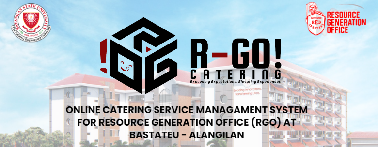

# Final Project

### ONLINE CATERING SERVICE MANAGEMENT SYSTEM FOR RESOURCE GENERATION OFFICE (RGO) AT BATSTATEU - ALANGILAN

## INTRODUCTION
The web-based platform for the RGO will comprise functionalities to handle catering orders and financial transactions, as well as a searchable database, trend analytics, and backup and recovery mechanisms. Implementing this user-friendly system will alleviate the burden of manual tasks and improve the overall experience for clients and users. This type of service plays a crucial role in supporting various events and activities on campus, including meetings, conferences, seminars, and other gatherings. 
Setup Ionic Project</a> for guidance

3.Unzipped the project somewhere else but not in the created project folder

4.Copy the src file from the unzipped project and paste in the project folder (replace all)

5.Run ionic serve
# About us
## Developers

- [Pangilinan, Nico Alfonso N.](https://github.com/Nicopangilinan)

- [Sarmiento, Trisha Fae S.](https://github.com/BIBII23)

- [Valenton, Gabriel P.](https://github.com/dubs910)
